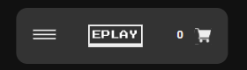
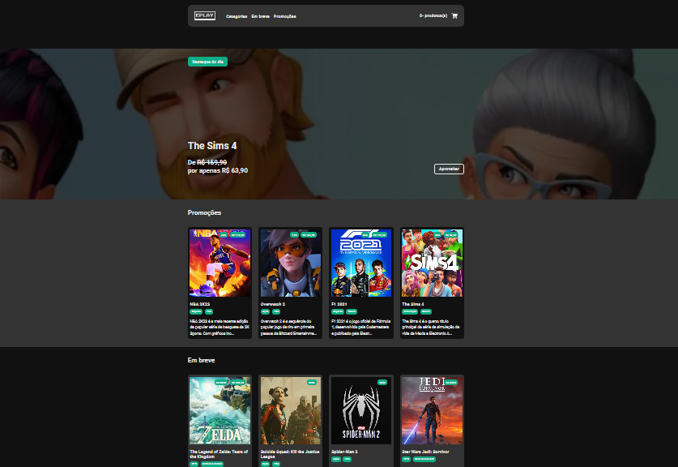
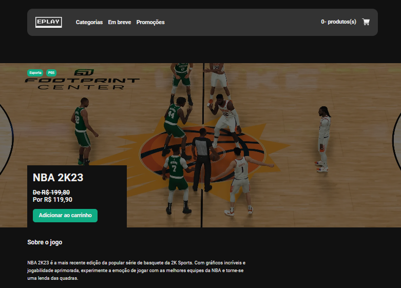
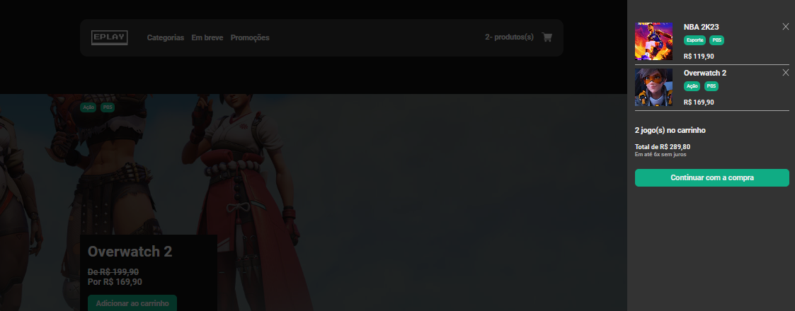
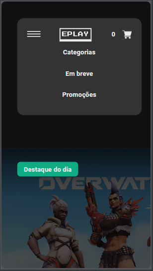
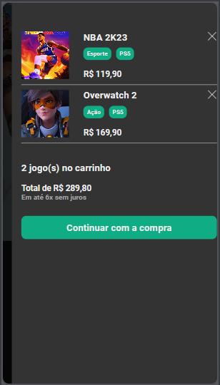
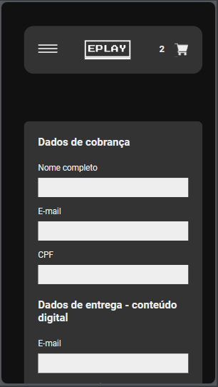

<hr>

### Tópicos

- [Descrição do projeto](#descrição-do-projeto)

- [Funcionalidades](#funcionalidades)

- [Layout](#layout)

- [Ferramentas utilizadas](#ferramentas-utilizadas)

- [Figma do Projeto](#figma-do-projeto)

- [Acesso ao projeto](#acesso-ao-projeto)

- [Abrir e rodar o projeto](#abrir-e-rodar-o-projeto)

- [Desenvolvedor](#desenvolvedor)

## Descrição do projeto

<p align="justify">
 Projeto desenvolvido fazendo toda a parte Front-End de um site e-commerce para uma loja virtual de jogos. Seus dados são preenchidos através de uma API, contando também com um layout muito agradável e bem responsivo. Faz toda a movimentação necessária para adicionar itens ao carrinho, indo até um formulário para pagamento, fazendo sua validação e finalizando a compra.
  


</p>

## Funcionalidades

:heavy_check_mark: `Funcionalidade 1:` Loja virtual de jogos com diversas seções de categorias diferentes.

:heavy_check_mark: `Funcionalidade 2:` Ao selecionar um produto, o mesmo é levado a uma página que traz informações detalhadas, contendo galeria com fotos e vídeos, que ao serem clicados, são abertos de maneira ampliada.

:heavy_check_mark: `Funcionalidade 3:` Adicionar produtos ao carrinho, trazendo toda a operação que faz a gestão da quantidade e dos valores dos produtos adicionados. 

:heavy_check_mark: `Funcionalidade 4:` Formulário para pagamento, com opções de boleto bancário ou cartão de crédito.

## Layout

<div align="center">





### Layout Responsivo

      

  </div>

###

## Ferramentas utilizadas

        

- React
- Redux
- TypeScript
- JavaScript
- HTML
- Git
- Styled-Components

🎈 <i><b>OBS:</b></i> 

Foi utilizado o Redux para fazer o gerenciamento de estado da aplicação, evitando passar as propriedades por muitos componentes, visto que o projeto tem muitas páginas e componentes.
O uso do Styled-Components resolve alguns problemas, como a repetição de códigos, visto que nos permite criar componentes reutilizáveis e compartilháveis, tornando manutenções e futuras mudanças mais simples.

Fazendo a validação do formulário com useFormik e validationSchema e usando o InputMask para criar uma máscara nos campos de input.

###

## Figma do Projeto

<a href="https://www.figma.com/file/FiFpwvwwHX0rCbrXatjMg4/EPLAY?mode=design&node-id=1-3&t=TCXv1jUjROMi4CV1-0&type=design" target="_blank"></a>

## Acesso ao projeto

Você pode <a href="https://eplay-store.vercel.app/" target="_blank">acessar o site do projeto.</a>

## Abrir e rodar o projeto

```cmd
# Clone este repositório
git clone <link do repositório>

# Acesse a pasta do projeto no seu terminal
cd <nome do projeto>

# Instalar dependências
npm install

# Execute a aplicação
npm start

```

## Desenvolvedor

[<br><sub>Bruno Dias de Freitas</sub>](https://www.linkedin.com/in/brunodias-dev)
